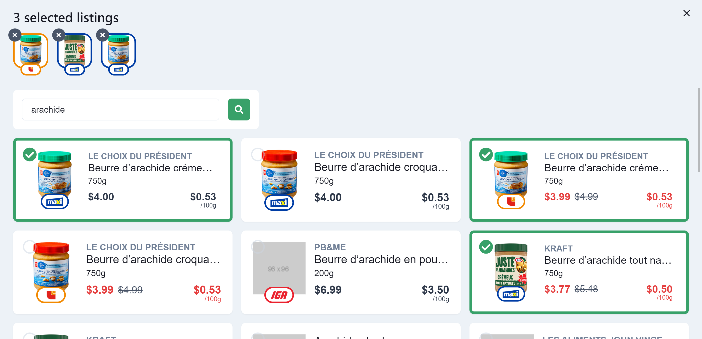

# 🛒 Pricebook <a href="#-project-status"></a>

A grocery price tracking tool that helps users find the best prices in their local stores and detect patterns so they can recognize when a sale is truly a good deal.

## Table of contents <!-- omit in toc -->

- [☀ Introduction](#-introduction)
- [📷 Preview](#-preview)
    - [Listings page](#listings-page)
    - [Listings details drawer](#listings-details-drawer)
    - [Groups page](#groups-page)
    - [Group creation page](#group-creation-page)
    - [Listings selection drawer](#listings-selection-drawer)
- [💿 Setup](#-setup)
  - [Prerequisites](#prerequisites)
  - [Installation steps](#installation-steps)
  - [Usage](#usage)
- [🛠 Technologies Used](#-technologies-used)
- [🧪 Tests](#-tests)
- [🚦 Project Status](#-project-status)

## ☀ Introduction

Back in August 2020, I found myself comparing grocery prices online to find the best places to get my food as a student on a budget. 😅 I wondered if there were any better solutions to solve my problem and came up with this project idea. I decided to jump on it as it provided a good opportunity to learn about some topics that had been hanging in my head for a while:

- 🕷 Web scrapping
- 🧼 Application development following some variation of the [clean architecture](https://blog.cleancoder.com/uncle-bob/2012/08/13/the-clean-architecture.html)
- 🎨 Basics of decent UX design

If you're interested, you can [read more about how I approached this project, how I managed its development and what I learned from this whole experience](./docs/STORY.md).

## 📷 Preview

#### Listings page

This page allows users to search for listings across various grocery stores. Listings can be clicked on to view more details.


#### Listings details drawer

When a user clicks on one listing, a drawer opens up on the right with more details about the targeted listing and its price history.


#### Groups page

This page lists all of the users' groups. These groups make it easy for the user to compare similar products together and identify which is the best value at the current moment.


#### Group creation page

The group creation page allows a user to create a group and select his preferred comparison unit. Listings can be added through the listings selection drawer by clicking on the "Add Listings" button.


#### Listings selection drawer

The listings selection drawer is similar to the listings page. The user can search for specific listings in the search bar and selected listings will appear right over it.



## 💿 Setup

### Prerequisites

Make sure you already have those programs:

- [NodeJS](https://nodejs.org/en/) (I used version 16.13.2 LTS)
- [Docker](https://www.docker.com/products/docker-desktop) (I used version 20.10.12)

### Installation steps

Run the following commands to install the project:

```sh
# Clone the project in a directory of your choice
$ git clone git@github.com:vcheeney/pricebook.git

# Move into the project directory
$ cd pricebook

# Create the .env file from the template
# You can edit the values if you wish but defaults will work fine.
$ cp .env.example .env

# Install the project dependencies
$ npm install

# Build the project
$ npm run build
```

### Usage

In one terminal, start the database with the following command and leave the terminal running until you would like to shut the DB down.

```sh
# Start the database
$ docker-compose up
```

In another terminal, run the following command:

```sh
# Start the application
$ npm start

# If you prefer to start the development server
$ npm run dev
```

Access the app at http://localhost:3000/

## 🛠 Technologies Used

- [NextJS 10.0.0](https://nextjs.org/docs/getting-started) - Production ready React framework
- [MongoDB 3.6.3](https://docs.mongodb.com/v3.6/) - NoSQL database system
- [Chakra UI 1.0.4](https://chakra-ui.com/) - React components library
- [Formik 2.2.6](https://formik.org/) - React forms library
- [Chart.js 2.9.4](https://www.chartjs.org/docs/2.9.4/) - React charts library
- [Next-Auth 3.1.0](https://next-auth.js.org/v3/getting-started/introduction) - Authentication solution for NextJS apps
- [React Query 3.5.5](https://react-query.tanstack.com/overview) - Data synchronization solution for React apps
- [React Icons 4.1.0](https://react-icons.github.io/react-icons/) - Rich React icons library
- [Puppeteer 5.5.0](https://pptr.dev/#?product=Puppeteer&version=v5.5.0) - Headless chrome API
- [Cheerio 1.0.0-rc.3](https://cheerio.js.org/) - HTML parser for the server
- [Jest 26.5.23](https://jestjs.io/docs/26.x/getting-started) - Testing framework

## 🧪 Tests

Tests have been written for the core of the application. Run them with the following command:

```sh
# Run the tests
$ npm run test
```

## 🚦 Project Status


I archived this project in January 2021. The project used to be hosted on Vercel and MongoDB Atlas, but I shut it down as I lost interest in the problem the product was trying to solve.

Rather than delete the whole thing, I downloaded most of the content the tool had produced until then and saved it as seed data for a local MongoDB database runnable as a Docker container. That way, anyone can [clone the project](#installation-steps) and launch the app locally to get a feel for what this project was all about.

As mentioned earlier, you can read the full story of this project [here](./docs/STORY.md).
