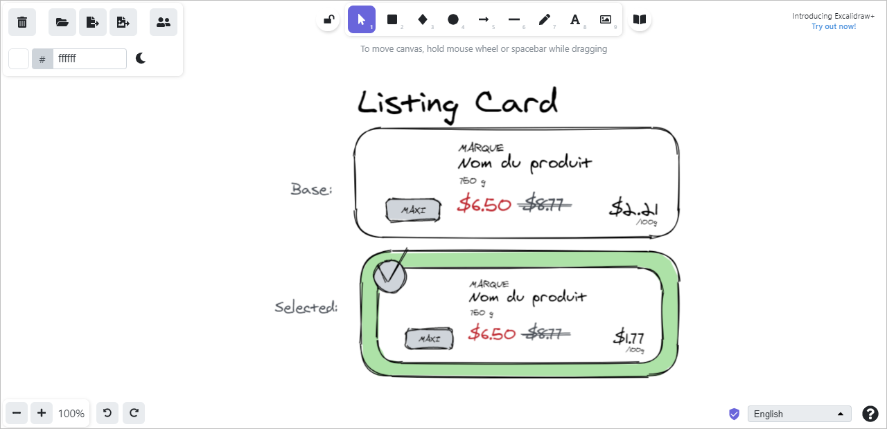
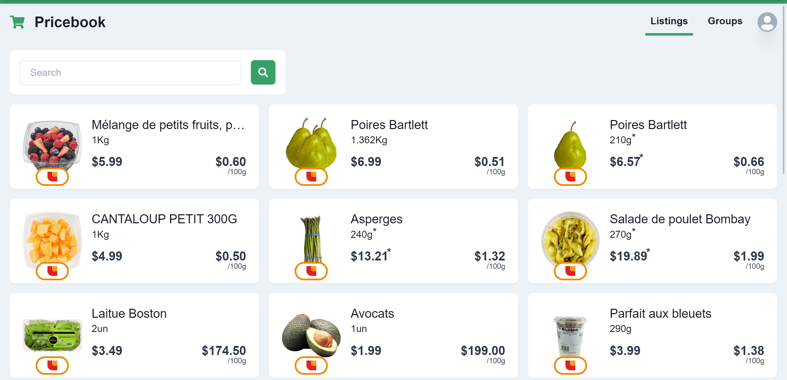

## Table of contents <!-- omit in toc -->

- [🎯 Motivation](#-motivation)
  - [🕷 Web scrapping](#-web-scrapping)
  - [🧼 Clean architecture](#-clean-architecture)
  - [🎨 Basics of decent UX design](#-basics-of-decent-ux-design)
- [🧐 Approach](#-approach)
  - [🧱 Building the core](#-building-the-core)
  - [🏬 Obtaining the data from stores' websites](#-obtaining-the-data-from-stores-websites)
    - [Experimenting](#experimenting)
    - [Scrapping the data](#scrapping-the-data)
    - [Normalizing the data](#normalizing-the-data)
    - [Storing the data](#storing-the-data)
  - [🗄️ Hosting the application on Vercel](#️-hosting-the-application-on-vercel)
    - [Creating the NextJS app](#creating-the-nextjs-app)
    - [Deploying to Vercel](#deploying-to-vercel)
    - [Triggering the store listings fetching automagically](#triggering-the-store-listings-fetching-automagically)
    - [Issues I encountered](#issues-i-encountered)
  - [🎨 Designing the front-facing app](#-designing-the-front-facing-app)
    - [Choosing the tools](#choosing-the-tools)
    - [Designing in a feature-oriented manner](#designing-in-a-feature-oriented-manner)
  - [🖥 Implementing the front-facing app](#-implementing-the-front-facing-app)
  - [🔌 Connecting everything together](#-connecting-everything-together)
- [💭 Reflection post-project (one year after)](#-reflection-post-project-one-year-after)
  - [💡 Things I learned](#-things-i-learned)
    - [Web scrapping is not all sunshine and roses](#web-scrapping-is-not-all-sunshine-and-roses)
    - [NPM packages version matter](#npm-packages-version-matter)
    - [Chasing the perfect architecture from the start can be dangerous](#chasing-the-perfect-architecture-from-the-start-can-be-dangerous)
  - [🤔 What I would do differently](#-what-i-would-do-differently)
    - [Be more specific (reduce the scope)](#be-more-specific-reduce-the-scope)
    - [Change hosting setup](#change-hosting-setup)

## 🎯 Motivation

### 🕷 Web scrapping

I don't know what it is about these systems but I was fascinated when I learned about them back in August 2020. I often had ideas for products but did not know how to get them "alive." That is an issue that often occurs with websites/apps that are based on user-generated content. Web scrapping here seemed to be the solution to all my problems. In the end, I learned quite a few things about it in the course of this project which I'll detail a bit more as we go on with this article.

### 🧼 Clean architecture

I had just started learning about Uncle Bob's [clean architecture](https://blog.cleancoder.com/uncle-bob/2012/08/13/the-clean-architecture.html) and wanted to see if I could implement some of the principles he promotes into this project. I'm a complete novice in this area, so please excuse my less than optimal structural decisions.

### 🎨 Basics of decent UX design

It's common thing for developers to lack design skills. I wanted to use this project to try to make something that does not look like complete garbage. 🤞 I think I did okay and will discuss it more in a later section as well.

## 🧐 Approach

### 🧱 Building the core

First things first, as I've seen countless times in clean architecture-related books, blogs and videos, I wanted to build my application core completely independent of all frameworks. Therefore, I started my project with a simple `core/` directory containing a couple of TS files.

For my entities, I decided to go with simple javascript objects and have separate [pure functions](https://en.wikipedia.org/wiki/Pure_function) (deterministic functions with no side effects: same inputs = same outputs) act on those objects:

[core/listing.ts](../core/listing.ts)

```typescript
export type Listing = {
  _id?: string
  unavailable?: boolean
  // ...
}

export const markListingUnavailable = (listing: Listing): Listing => ({
  ...listing,
  unavailable: true,
})

// ...
```

For my use cases, I created a `core/usecases/` directory where each use case would be a function contained in its file. For each use case function, I wrote a dedicated port interface where the arguments and the dependencies would be passed:

[core/usecases/CreateGroup.ts](../core/usecases/CreateGroup.ts)

```typescript
export type CreateGroupPort = {
  // ...
  getListingsByIds: GetListingsByIds
  postGroup: PostGroup
  respond: (group: Group) => void
}

export type CreateGroupUseCase = (port: CreateGroupPort) => Promise<void>

export const createGroupUseCase: CreateGroupUseCase = async ({...}) => {
  // ...
}
```

That way, my core was completely independent of any external elements (server, database, UI, etc.). This allowed me to develop the business rules of my application following a test-driven development approach. If you inspect the `core/` directory, you'll see that each entity and use case file has its respective test file.

[core/usecases/CreateGroup.test.ts](../core/usecases/CreateGroup.test.ts)

```typescript
// ...
import { CreateGroupPort, createGroupUseCase } from './CreateGroup'

describe('CreateGroup', () => {
  const expectedPostedGroup: Group = {...}

  const defaultPort: CreateGroupPort = {
    // ...
    postGroup: jest.fn(() => Promise.resolve(expectedPostedGroup)),
  }

  // ...

  it('should post the group to the repository', async () => {
    await createGroupUseCase(defaultPort)
    expect(defaultPort.postGroup).toHaveBeenCalledWith(expectedPostedGroup)
  })

  // ...
})
```

### 🏬 Obtaining the data from stores' websites

#### Experimenting

To start experimenting with web scrapping, I created a `.lab/` directory where I put a bunch of quick scripts and sample data files.

#### Scrapping the data

The first thing I learned as I started to mess around with web scrapping is that there are a ton of strategies that fit different purposes:

- Some sites are server-side rendered and can simply be fetched and parsed using a tool like [Cheerio](https://cheerio.js.org/).

- Others are client-side rendered and therefore need a browser to run the site's javascript code to populate the data. For those cases, [Puppeteer](https://pptr.dev/) is a good tool for the job.
- In some cases, client-side rendered sites make use of APIs that do not require a very specific configuration (ex: recent keys or a specific browser). In those rare cases, we can check the network tab of the chrome dev tools and figure out how to call those same APIs from our apps. **It is worth mentioning that you should not abuse those APIs as you have not received explicit authorization to use them.** 😉

As I was exploring the different grocery store websites I wanted to scrape the data from, I noticed that some, which are part of the same parent company, had the same structure.

Particularly, [Loblaw](https://www.loblaw.ca/) companies websites ([Maxi](https://www.maxi.ca/), [Provigo](https://www.provigo.ca/), [Loblaws](https://www.loblaws.ca/), etc.) are client-side rendered as we can notice by loading their site with JavaScript disabled. As I browsed through the products page while keeping an eye on the chrome devtools networks tab, I noticed that requests were made to a certain API endpoint.

By copying the request as a Node.js fetch and tweaking some parameters, I managed to get it working in my [backend](../core/fetchers/fetchMaxiListings.ts).

> 🚨 Their API seems to have changed a bit since I first built the fetcher.

Some other stores (ex: [Metro](https://www.metro.ca/en)) had a website but had bot blocking systems making it much harder to access the data I required. I could easily access the site from my chrome browser, but the chromium browser used by Puppeteer would get detected, and I would only get error pages as I tried to fetch products.

Finally, some of the local stores I wanted to track (ex: [Super C](https://www.superc.ca/index.fr.html)) did not have a website with a list of the current product prices. So that was problematic. 😅

#### Normalizing the data

It's nice to have the ability to fetch some data from stores websites, but without a way to normalize that data, it would not be comparable.

I created a few functions for that in my fetchers files.

Some of the fields (product name, brand, etc.) were easy to extract, but others (i.e., package sizes) and prices were much more difficult. I created regex expressions for this purpose.

[core/size.ts](../core/size.ts)

```ts
//...

export function parseSizeString(str: string): ListingSize {
  const packageSize = str.toLowerCase()

  const number_g = /^((\d*\.)?\d+)\s*g$/
  const number_ml = /^((\d*\.)?\d+)\s*ml$/
  // ...

  if (packageSize.match(number_g))
    return makeSimpleSize(number_g, packageSize, Units.g)
  if (packageSize.match(number_ml))
    return makeSimpleSize(number_ml, packageSize, Units.ml)
  // ...
  throw new CustomError('Size string cant be parsed: ' + str, { str })
}

//...
```

Since there were LOTS of different possible values for package sizes, I used my fetchers to fetch some raw data, then reduce the listings information into arrays of possible package size strings (See [tests/maxiPackageSizes.json](../tests/maxiPackageSizes.json) for example). I then passed every entry in that array to a unit test that exercises my `parseSizeString(...)` function. When I'd see the custom error thrown, I would dive into the function and add the proper parsing.

#### Storing the data

Great! At this point, I could fetch data and normalize it for a couple of stores. Now I needed to figure out a way to store the listings information and its price history efficiently.

I chose MongoDB Atlas at this point because I knew they had okay text querying capability (which I needed for my listings search in the app), but with hindsight, I probably should have put a bit more thought into this and explored what were the other options.

I created a listings collection that would directly store my listings object (the type I defined in [core/listing.ts](../core/listing.ts)).

To keep track of the price history, I set a `pastPrices: ListingPrice[]` array which would be extended at any price change. Otherwise, the last entry would see its `lastSeenDate: Date` property updated:

```ts
export type ListingPrice = {
  value: number
  isSale?: boolean
  setDate: Date
  lastSeenDate: Date
}
```

### 🗄️ Hosting the application on Vercel

#### Creating the NextJS app

Now that I had some fetchers and a database running, it was time to finally add a framework to the equation.

I opted for NextJS as I was already quite familiar with it. I also knew that I could deploy my app to Vercel very easily and for 0$. Good deal! Or so I thought. 😆

So I created an empty NextJS app and wrote my first API routes connecting the use cases I previously built when I wrote my core to some real concrete implementations of the abstractions they required.

#### Deploying to Vercel

Connected my GitHub account to Vercel, imported the project, done! ✅ Thanks [@rauchg](https://github.com/rauchg)

#### Triggering the store listings fetching automagically

That is when I realized that, on Vercel, there was no native way to trigger a cloud function at a certain time interval like a cron job.

I remembered having already used Google Apps Scripts to automate some tasks in a Trello project I did in the past.

I used a similar script to trigger my store syncing cloud function daily.

#### Issues I encountered

1. Vercel limits cloud function execution time to 5 seconds for free accounts (I think it used to be 10 seconds, but still, it was very short). This sometimes caused my syncing function to timeout before finishing up.
2. It was a bit of a pain to have to maintain two code bases (the main one here and a much smaller very simple one on Apps Scripts).

### 🎨 Designing the front-facing app

#### Choosing the tools

Time for some frontend work! Finally!

Before writing any React code, I wanted to have a general idea of the design I was looking for. Therefore, I started looking for a good (simple enough) design tool that would make it easy for me to complete this task.

I thought of using [Figma](https://www.figma.com/), but I figured that I would not gain so much from high fidelity mockups and should therefore opt for a simpler minimal tool that would allow me to create low fidelity sketches. These hand written feel designs would make me focus on functionality rather than the minutia of details.

For this purpose, [Excalidraw](https://excalidraw.com/), a minimal whiteboard tool, was perfect for the job.

#### Designing in a feature-oriented manner

When I get in front of a white page, it's very hard for me to just "start designing" the pages. Therefore, I took a feature-oriented approach. Rather than designing the landing page, for example, I designed the listings cards, the create group form, etc.



### 🖥 Implementing the front-facing app

When I had a few decent designs created, I started implementing them in React. My NextJS application had already been created so I simply had to add the pages and build the components.

At this stage, I hesitated between going for TailwindCSS or a component library I had recently learned about: [ChakraUI](https://chakra-ui.com/). Since I already worked with TailwindCSS in the past but was curious to try something new, I gave this other library a shot.

I was quite pleasantly surprised with how the whole thing went.



### 🔌 Connecting everything together

Now that I had some data stored and the shell of a frontend application, it was time to put everything together and make the app interactive.

I used [Next Auth](https://next-auth.js.org/) to easily implement Google authentication in the app.

> 🚨 I replaced the Google authentication with a custom user/password authentication flow when I archived this project to make it easier to install locally for further reference.

I then used React Query to set up my frontend data fetching. I did not want to use Redux as I don't think it is the best solution for backend data synchronization. I don't have much global state either in my application and the server state is better served with a library like React Query.

## 💭 Reflection post-project (one year after)

### 💡 Things I learned

#### Web scrapping is not all sunshine and roses

Turns out that web scrapping is not the solution to everything. Not only is the question on the ethics of the practice unanswered, but all websites also have different setups and require quite a lot of configuration to scrape. Not only that but those configurations are very likely to change which requires you to always keep an eye open to keep your systems functioning properly. (Ex: Since I archived this project, lots have changed and the fetchers I wrote back then do not work anymore)

#### NPM packages version matter

I found myself struggling with Next Auth more than I anticipated when I built my authentication system. I later realized that I was using the v3 version but looking at the v4 documentation. 🤦‍♂️ Really? 😂

#### Chasing the perfect architecture from the start can be dangerous

I spent WAY too many hours debating with myself about how I would build my entities (use classes or objects + functions, etc.) and procrastinating due to the overwhelming amount of fear I had to make the "wrong" decision. In the end, I realize that I could have made more progress quicker if I had taken a decision more promptly and moved on.

### 🤔 What I would do differently

#### Be more specific (reduce the scope)

Rather than try to fetch all prices from all stores, I would make life simpler for myself and better for the users by doing the following:

1. Create a chrome extension that would inject a "Track listing" button to listings on supported stores' websites.

2. The extension would send the product URL to the backend where it would be saved into a _tracked listings_ array

3. Make the application only track those products

This would allow a user to profit from the much better listings search feature already implemented in the stores' websites. It would also free me from having to implement such a feature myself as my application would only show the user the listings he previously selected.

Having to sync so many listings in this iteration of the project was quite a pain that could have been avoided had I realized that I could be more specific to start with.

#### Change hosting setup

I would experiment with a different hosting solution so that I could deploy my whole app "in one go" rather than maintain many different sub-projects.

Also, I would specifically search for a serverless solution that would allow me to run code for longer than 5 seconds.
